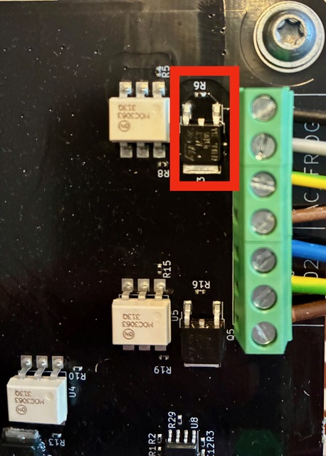
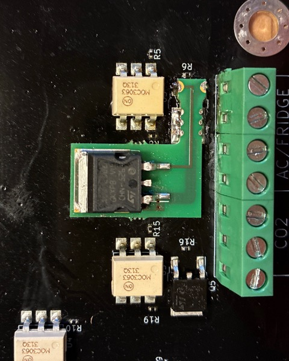

([find English version here](TriAC-FIX.en.md))

# Einbau des KS-Fix auf dem Mainboard

Falls du das Problem hast das der Kühlschrank dauerhaft läuft und er keine Ein- und Ausschaltsignale mehr vom Modul 
annimmt, dann ist der TriAC defekt.

Erkennen kann man dies daran, dass das Modul im Portal anzeigt, dass der Kühlschrank ausgeschaltet wäre, obwohl er 
tatsächlich eingeschaltet ist.

## Overview

Es gibt leider einen Serienfehler bei Modulen vor der Seriennummer 13115. Bei diesem Fehler ist ein Bauteil zu schwach 
ausgelegt und wird über kurz oder lang defekt werden.

### Details

Der KS-Fix Dateien kann man über den Hardwarebereich auf der Github Plantalytix Seite z.B. bei Aisler fertigen lassen. 
Günstiger ist es aber, diese über die Community Admins in größerer Stückzahl fertigen zu lassen.

Das Auslöten des defekten TirAC geht am Besten mit Heißluft. Das Einlöten des TriAC-Fix Boards dann mit einem normalen 
Lötkolben. Es folgen zwei Bilder: 

#### Vorher

#### Nacher

