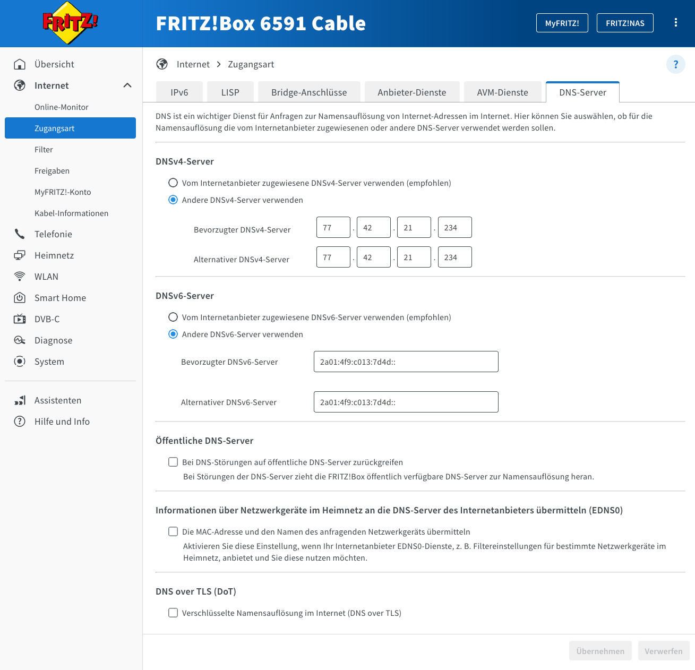

# Upgrading an old firmware

If you don't have the latest firmware with the "Change server" option, this will
guide you through upgrading your firmware to the latest version.

## Overview

The old firmware still tries to contact the old server located at `plantalytix-app.com`. For this reason, it is 
necessary to make sure, that this old domain points to a upgrade-server. The upgrade-server is automatically instructing 
devices to download a newer firmware (with the "Change server" option), as soon as they connect.

### Details

There are many ways to make sure, that the old domain points to the upgrade-server. The method heavily depends on your
network setup. The key points are:

The following domains must resolve to the upgrade-server IP address `91.98.231.109`:
- `api.plantalytix-app.com`
- `api2.plantalytix-app.com`
- `mqtt.plantalytix-app.com`
- `mqtt2.plantalytix-app.com`

Alternatively, you can use a wildcard DNS entry for `*.plantalytix-app.com` to point to the upgrade-server.

## Upgrade DNS Server

We are providing a public DNS server, which resolves the required domains to the upgrade-server:
- `77.42.21.234` (IPv4)
- `2a01:4f9:c013:7d4d::` (IPv6)

You can debug the DNS resolution, by checking the following website:
http://77.42.21.234/log.php
(This website logs all DNS requests it receives, so you can see if your device is using the DNS server correctly.)

As long as you can make sure your device uses this DNS server, the upgrade will work.

Please note: It is not sufficient, that your computer uses this DNS server. The device itself must use it.

### Using the DNS server

This steps heavily depend on your network setup. The most common way is to configure your router to use this DNS
server. Please refer to your router documentation on how to do this.

#### Example using Fritz!Box

Here you can see an example of how to set up the DNS server in a Fritz!Box router:

## Triggering the Upgrade

Once the DNS is set up correctly, you can trigger the upgrade by restarting your device (power off => power on).
If the upgrade doesn't start automatically after that, please contact the admins in the Telegram channel to help you 
further.